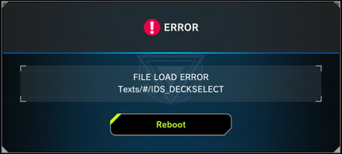

# Loading errors

You may see some variation of the above error or infinite loading screens, corrupt screens, etc. There are a few reasons this might happen.

## 1) Game not updated / multiple folders inside of LocalData

Fully update your game. If you have multiple folders inside of LocalData, you need to make sure they are ALL updated or delete the ones which aren't updated.

YgoMaster picks the first valid folder it finds in LocalData. There is no way for YgoMaster to know which is the updated folder.

## 2) Language setting missmatch

Change the language to match the language set via Steam. If the issue persists follow these instructions:

- Navigate to `/Yu-Gi-Oh! Master Duel/LocalSave/`.
- There should be two folders in `/LocalSave/`; one with a bunch of random letters, and one called `00000000`.
- Delete the contents of the `00000000` folder, and copy the contents of the random letters folder into the `00000000` folder.

## Note

Support is not provided beyond these instructions as these are the only known ways of fixing these issues.