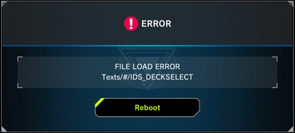

# Loading errors

You may see some variation of the above error or infinite loading screens, corrupt screens, etc. There are a few reasons this might happen.

## 1) Game not updated / multiple folders inside of LocalData

Fully update your game. If you have multiple folders inside of LocalData, you need to make sure they are ALL updated or delete the ones which aren't updated.

You may need to fully open the game with Steam multiple times. Some updates have additional data downloads the second time you open the game.

## 2) LocalSave

- Navigate to `/Yu-Gi-Oh! Master Duel/LocalSave/`.
- There should be two folders in `/LocalSave/`; one with a bunch of random letters, and one called `00000000`.
- Delete the contents of the `00000000` folder, and copy the contents of the random letters folder into the `00000000` folder.

You may need to repeat this step multiple times (fully reopening with Steam, and copying the folder over to `00000000` until it works).

## Note

- You need to go the home screen of the game using Steam for both the LocalData / LocalSave steps. The home screen is the screen where it shows your duelist name and level in the top left of the screen.
- Support is not provided beyond these instructions as these are the only known ways of fixing these issues.