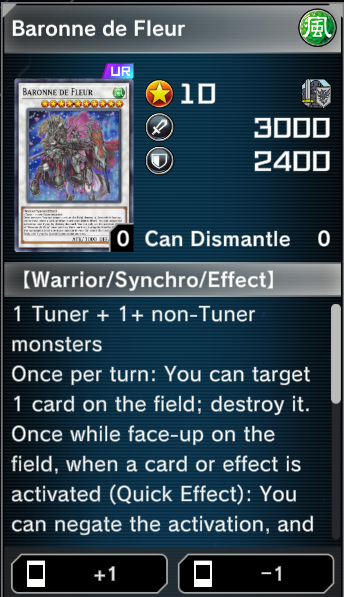

# Settings

There are many settings which can be configured. [JSON](https://wikipedia.org/wiki/JSON) is the file format used for most setting files. Additionally some txt files (varying formats) are used.

Single line comments are supported in json files (`//`).

If you edit any json file you should reopen `YgoMaster.exe` (and in some cases the game).

## Important settings

These settings are probably important to the average user.

### /Data/Decks/\*.json;\*.ydk

The player decks.

You can copy/paste/move/rename (but not modify the contents of) files in this folder and they will automatically update in the game without having to reopen `YgoMaster.exe`. If you're already in the deck selection screen you will need to go to the home screen and re-enter the deck selection screen to see the updated decks.

### /Data/Player.json

- `Gems` - the number of gems owned.

### /Data/Settings.json

- `DisableBanList` - disables the ban list.
- `DefaultGems` - sets the default number of gems (unimportant once `Player.json` exists).
- `SoloRemoveDuelTutorials` - disables tutorial duels (they are turned into normal duels; this currently set to true).
- `UnlockAllCards` - unlocks all cards in the game.
- `UnlockAllItems` - unlocks all items in the game.
- `UnlockAllSoloChapters` - unlocks all solo content.
- `CardCraftableAll` - sets all cards to craftable.
- `DuelRewards` - custom reward list (needs balancing, you can also delete the entry to disable custom rewards).
- `Craft` - card crafting cost / dismantling reward.
- `DisableNoDismantle` - all cards given to the player can be dismantled (doesn't impact previously given cards).

### /Data/Shop.json

- `DisableCardStyleRarity` - can be used to disable shine/royal on opened packs.
- `UnlockAllSecrets` - unlocks all secret packs.
- `PutAllCardsInStandardPack` - puts all cards into the standard (master) pack.
- `NoDuplicatesPerPack` - avoids getting duplicate cards on individual packs.

### /Data/ClientData/ClientSettings.json

- `DeckEditorDisableLimits` - lets you add banned cards and more than 3 of any card in the deck editor.
- `DeckEditorShowStats` - displays card collection stats in the deck editor.
- `DeckEditorConvertStyleRarity` - adjusts shine/royal based on owned cards when using the deck editor sub menu import options (if disabled this will preserve shine/royal status on the imported data).
- `DuelClientShowRemainingCardsInDeck` - shows the remaining cards in your deck when you click on your deck (ordered by card id).
- `DuelClientMillenniumEye` - reveal any card you click. If "Display Face-Down Cards as Transparent" is enabled all face downs will be visible.
- `DuelClientTimeMultiplier` - time multiplier applied during duels (speed up / slow down the game).
- `ReplayControlsAlwaysEnabled` - always show the replay controls (pause / speed up the game).
- `ReplayControlsTimeMultiplier` - time multiplier applied when fast forward is active (speed up / slow down the game).

## File list

- `CardBanList.json` - the ban list.
- `CardCraftableList.json` - a list of all craftable cards in the game.
- `CardList.json` - a list of all available cards in the game (and their rarities).
- `CustomDuel.json` - used to start custom duels (duel settings which replaces the tutorial duel).
- `Player.json` - the player settings (created when the player is first saved).
- `Settings.json` - the server settings.
- `Shop.json` - the shop settings / all shop items.
- `ShopPackOdds.json` - the pull rates of packs.
- `ShopPackOddsVisuals.json` - configures how packs should be displayed (glowing packs, glowing cards, etc).
- `Solo.json` - all solo gates / chapters and their rewards (textual information is stored in client data).
- `YdkIds.txt` - ydk ids <-> card ids.
- `/ClientData/ClientSettings.json` - settings specific to `YgoMasterClient.exe`.
- `/ClientData/IDS/*.txt` - custom text settings.
- `/Decks/*.json;*.ydk` - all decks owned by the player.
- `/SoloDuels/*.json` - duel settings for solo content.
- `/StructureDecks/*.json` - all structure decks in the game.

# Creating custom content

There isn't any documentation for this at the moment. But you can learn by example by looking through https://github.com/pixeltris/YgoMaster/issues/1

Without any specialized tools it's possible to:

- Change card images.
- Add a some missing cards (they need to already be in the data files such as `Baronne de Fleur`).
- Add custom packs (images, text).
- Add custom structure decks (contents, text).
- Add custom solo content (gates, chapters, text, images) (but no scenario modifications).
- Add linear progression of pack openings (i.e. progression series).

There are currently issues with the custom content loader. It eats ram with larger images and slows down the game while loading (no async loading).

An alternative to this is manually creating unity files and placing them in the right location. Setting `ShowConsole` / `AssetHelperLog` to true in `ClientSettings.json` can be used to find files, and the command `crc` to locate where a file should be placed on disk from it's input path. `AssetHelperDump` will also dump image files into `/Data/ClientDataDump/` as they are loaded.

