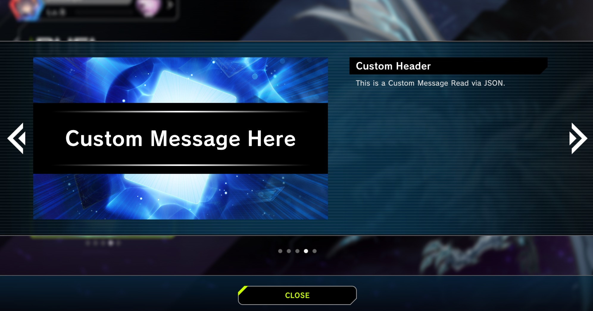

# Topics

Topics are shown in a small widget at the bottom left of the home sreen. They are refreshed everytime you go to the home screen.
.

## Usage

Open `Data/ClientData/ClientSettings.json` and set `HomeDisableUnusedTopics` to `false`. If this isn't `false` then the topics widget will be hidden.

The `Data/Topics` folder holds all of the topics and they are all sent to the client when you visit the home screen. The topics will appear in game in the order in which they are read from the folder.

See the following for an example topic [/YgoMaster/Data/Topics/YgoMaster.json](/YgoMaster/Data/Topics/YgoMaster.json)

### Keys
- `Title` - The main text that will be displayed on the widget. You can also use color tags (*<color=#00eeeff>text will be colored goes here</ color>)*

- `BackImage` - Path of the image you want the background to have. *(e.g. "Images/Notification/System/Background/tcg/Notice001")*

- `prefPath` - The type of topic to use which defines the layout on the widget (e.g. new card pack, notice, new structure deck, etc). *(e.g. "Prefabs/Notification/Topics/BannerNotify")*

- `body` / `contents` - This is defines what is displayed when you click on the topic in the widget

To add Headers use the Following Template. (Replace Custom Header with the text you want to show)
	` { "tp": "H1", "text": { "en_US": "Custom Header" }`

To Show normal Text use the Following Template for. (Replace the Custom Message String with your message)
	`{ "tp": "Text", "text": { "en_US": "This is a Custom Message Read via JSON." }, "indent": -1 }`
	
The Text item must have the locale or it will fail to display the text.

It's strongly recommended to log topics from Master Duel using Fiddler to find how different types of topics are structured. See [Updating.md](Updating.md) on how to do this.