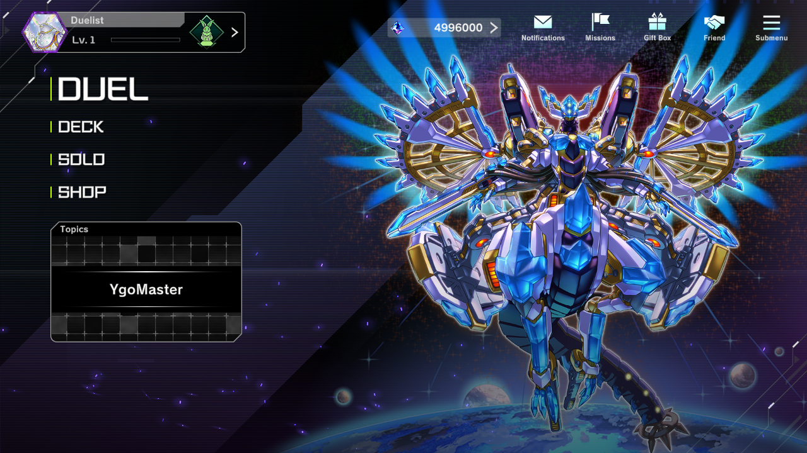
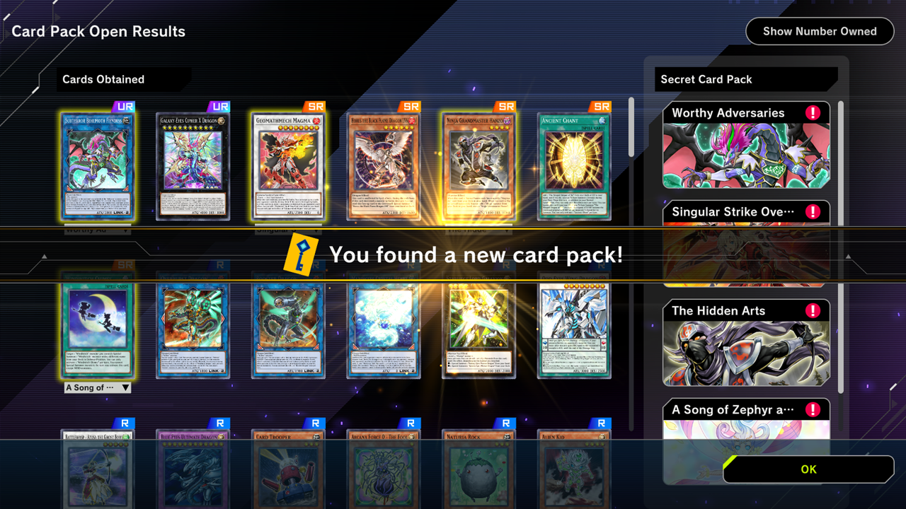
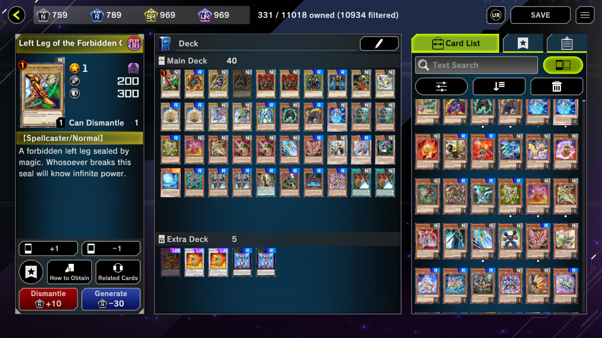
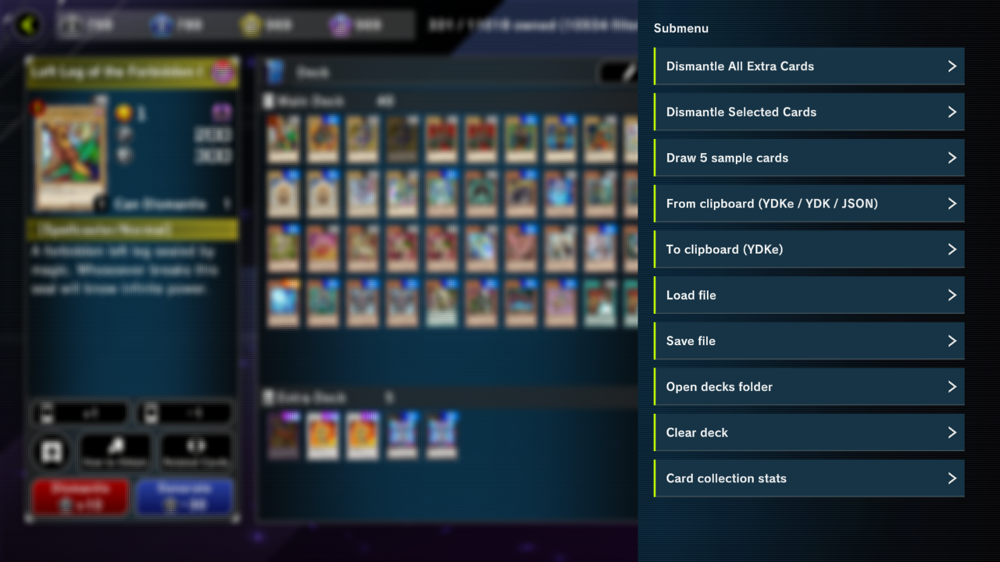
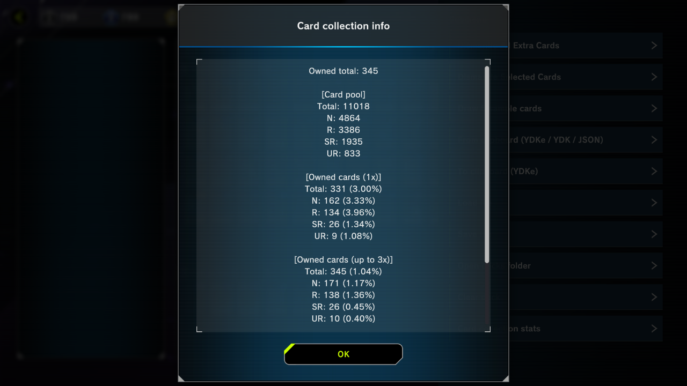
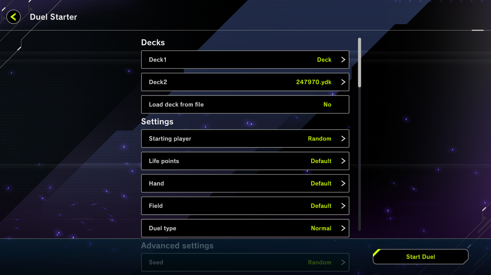
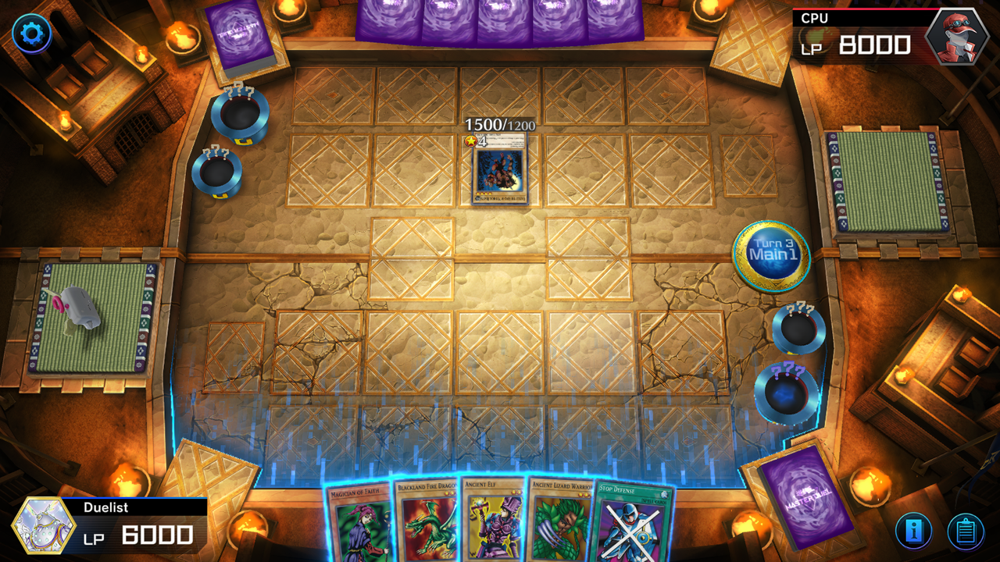

# YgoMaster

Offline Yu-Gi-Oh! Master Duel (PC)

*Online (PvP) functionality is not implemented. Progress is not shared with the live game.*

## Features

- Create decks
- Open packs
- Solo content
- Custom duels
- YDK / YDKe support
- Card collection stats / deck editor sub menu improvements

[Some features can be modded into the live game (at your own risk).](Docs/LiveMods.md)

## Requirements

- .NET Framework 4.0 (or above).
- The game fully downloaded via Steam (~5GB).

*You must complete the tutorial on Steam to fully download the game.*

*YgoMaster is portable. It can be used on any machine without Steam installed (after being fully downloaded).*

## Usage

- Download the latest release from https://github.com/pixeltris/YgoMaster/releases
- Copy the `YgoMaster` folder (the folder, not the contents of the folder) into the game folder.
- Run `YgoMasterClient.exe` (this should also auto run `YgoMaster.exe`, if it doesn't manually run it).

Additionally...

- *If you see errors, infinite loading screens, corrupt screens, etc [follow these instructions](Docs/FileLoadError.md).*
- [It's recommended that you tailor the server settings to your preferences.](Docs/Settings.md)
- Download [VG.TCG.Decks.7z](https://github.com/pixeltris/YgoMaster/releases/download/v1.4/VG.TCG.Decks.7z) for ~6000 decks from the YGO video games.
- The custom duel starter UI can be accessed via the DUEL button on the home screen.
- When updating copy your `/YgoMaster/Data/Player.json` and `/YgoMaster/Data/Decks/`.

## Compiling from source

- Install Visual Studio with C++ compilers.
- Run `Build.bat`.
- Copy the `YgoMaster` folder into the game folder as mentioned above.

Running `Build.bat` is the equivilant of:

- Compiling `YgoMaster.sln` with Visual Studio.
- Compiling `YgoMasterLoader.cpp` with `cl`.

## Related

- https://www.nexusmods.com/yugiohmasterduel/mods - community mods
- https://www.nexusmods.com/yugiohmasterduel/articles/3 - modding guide
- https://github.com/SethPDA/MasterDuel-Modding/wiki - modding guide
- https://github.com/crazydoomy/MD-Replay-Editor - save / load replays

## Screenshots

