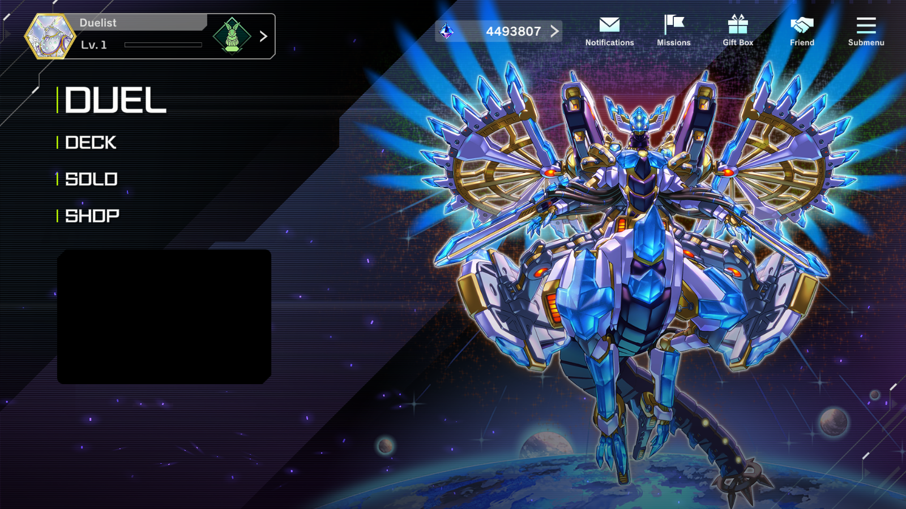
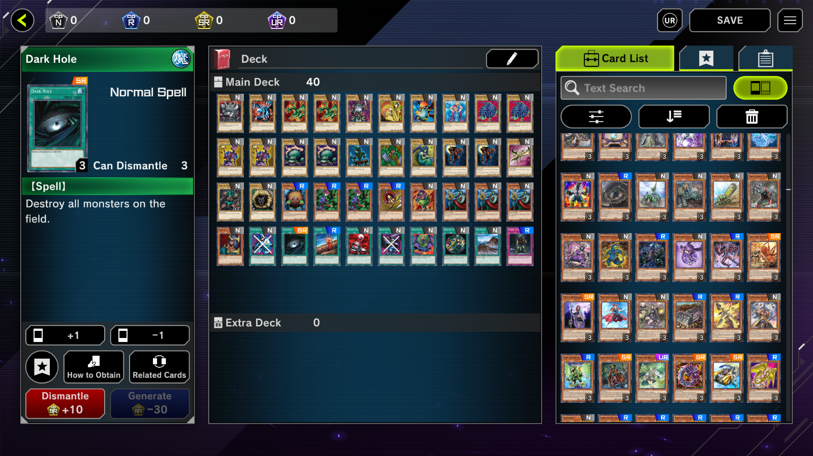

# YgoMaster

Offline Yu-Gi-Oh! Master Duel (PC)

## Screenshots

## Features

- Create decks
- Open packs
- Solo content
- Custom duels (by replacing the first chapter - see `CustomDuel.json`)
- ydk support

Online functionality is not implemented.

## Usage

Compile `YgoMaster.sln` and `YgoMasterLoader.cpp` (for the cpp read the top of the file).

Copy the `Build` folder (the folder, not the contents of the folder) into the game folder and run `YgoMaster.exe` / `YgoMasterClient.exe`.

## Related

- https://github.com/SethPDA/MasterDuel-Modding/wiki
- https://www.nexusmods.com/yugiohmasterduel/mods